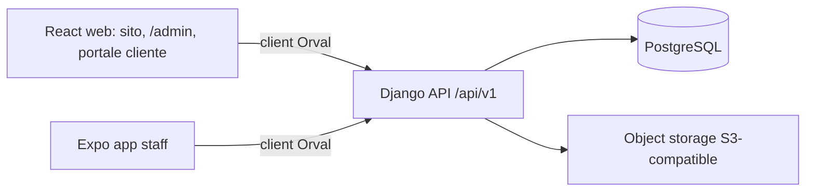

# RamoVerde

Piattaforma digitale di **RAMO VERDE SRL**: sito pubblico dinamico, gestionale staff (`/admin/*`) e app mobile staff, su un unico backend Django e un unico contratto OpenAPI.

Derivata da [`pianic2/template-fullstack`](https://github.com/pianic2/template-fullstack). Le regole di prodotto vivono su Confluence (space `WR`) con questa precedenza:

1. `WRM-CLIENT-SOT` — dati aziendali canonici (ciò che non è confermato resta `DA DEFINIRE`/`null`).
2. `UserStory` — perimetro funzionale v1.0.
3. `Stack` — baseline tecnica v1.0.
4. Issue Jira `WR-*`.
5. Questo repository.

## Architettura



```text
apps/backend/       Django API, domini, migrazioni, test PostgreSQL
apps/web/           React 19 + Vite: sito pubblico, backoffice, portale richiesta
apps/mobile/        Expo Router, UI da @personal-library/react-native-components
packages/api-client Client TypeScript generato da OpenAPI (mai editato a mano)
packages/shared     TypeScript platform-neutral
openapi/            Contratto generato e committato
docs/               Architettura, setup, governance agenti (DoR/DoD)
evidences/          Evidenze stakeholder e demo design (Design 09 selezionato)
```

## Avvio rapido

Requisiti: Docker Compose v2, Node 24 + Corepack, Python 3.13, uv.

```sh
cp .env.example .env
make setup        # dipendenze locked (uv + pnpm)
make dev          # PostgreSQL :5440, API :8010, web :5180
make migrate      # in un secondo terminale, su database nuovo
```

Solo database per test host-side: `make db`. Verifica ambiente: `make doctor`.

## Gate di qualità

```sh
make lint typecheck test   # backend, web, mobile, script
make api-check             # OpenAPI + Orval senza drift
make smoke                 # migrate + boot API + readiness DB
make check                 # gate completo (come CI)
```

Il flusso contratto è sempre `make api-schema` → `make api-client` → `make api-check`.

## Agenti

Leggere `AGENTS.md`, poi le istruzioni scoped (`apps/*/AGENTS.md`) e `docs/agents/`. Definition of Ready e Definition of Done di RamoVerde: [`docs/agents/definition-of-ready-done.md`](docs/agents/definition-of-ready-done.md).
