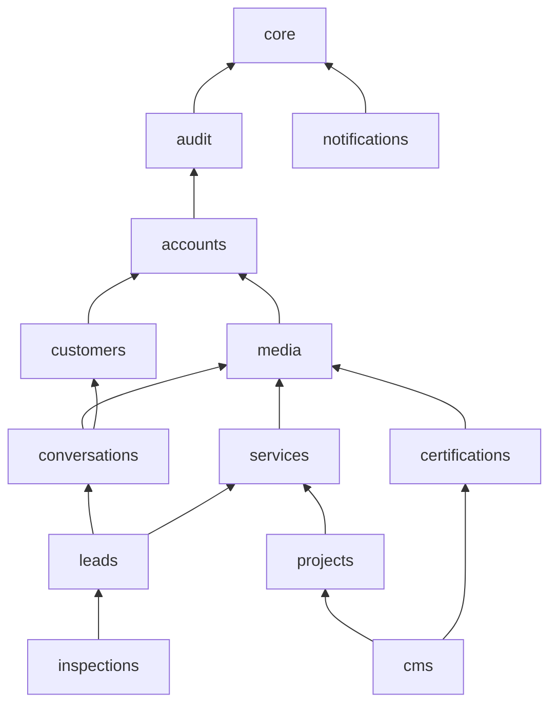

# Django domain modules and dependency boundaries

Source: Confluence `Stack` §25–26 (module list and MVP domain model). This page fixes **who owns what** and **who may import whom**, so several agents can work in parallel without creating cycles. The rule is enforced by `apps/backend/tests/test_architecture_boundaries.py`.

## Modules

All Django apps live in `apps/backend/apps/<module>/`. A module is created only when an issue needs it; until then this page is its contract.

| Module | Owns | Status |
| --- | --- | --- |
| `core` | Technical infrastructure only: health, error envelope, request id, logging. **No domain models.** | present |
| `audit` | `AuditEvent`, `record_event()` API. Append-only security/business trail. | Sprint 1 (WR-18) |
| `accounts` | Staff `User`, roles/permissions (RBAC), sessions/devices, MFA, password policy, web session + mobile JWT auth. | Sprint 1 (WR-13…17) |
| `media` | `MediaAsset` metadata, storage abstraction (S3-compatible), PUBLIC/PRIVATE visibility, upload validation. | Sprint 1 (WR-21) |
| `cms` | `Page`, `PageSection`, `NavigationMenu`, `NavigationItem`, `SiteSettings`, `SEOSettings`, section schema registry. | Sprint 1 (WR-19, WR-20) |
| `services` | `Service` catalogue (available vs future), publication state. | later |
| `certifications` | `Certification` (ISO 9001, SOA as confirmed by SOT). | later |
| `projects` | `Project` (works/portfolio), gallery links to media. | later |
| `customers` | `Customer` and contact data. | later |
| `conversations` | `Conversation`, `ConversationParticipant`, `Message`, `MessageAttachment`, `MessageReadReceipt`. Generic: knows nothing about leads. | later |
| `leads` | `Lead` request, status workflow and timeline; links customer, service, media and its conversation. | later |
| `inspections` | `Inspection` (sopralluogo) scheduling for a lead. | later |
| `notifications` | Domain event → channel fan-out (push/web/email). Domains publish events; notifications never imports domains. | later |

## Dependency rule

A module may import only from the modules listed for it (plus itself, Django, DRF and third-party packages). Arrows point from the importer to the dependency.

Every module may also use `core`, `audit`, `accounts` and `notifications` (the shared "kernel": infrastructure, audit trail, identity/authorization, event publishing). `audit` and `notifications` may import only `core`; `core` imports no module.

Consequences:

- `cms` can reference services, projects, certifications and media to compose public pages, but none of those may import `cms`.
- `conversations` is generic; `leads` owns the link to its conversation, so creating a lead can create a conversation without a cycle.
- Cross-module relations to the user model use `settings.AUTH_USER_MODEL`, never `from apps.accounts.models import User` in models.
- A lower module that must react to a higher one does it through a published domain event (`notifications`) or a Django signal declared by the lower module, not by importing upward.

## Ownership rules for agents

- Each module owns its models, migrations, serializers, views, `urls.py` and tests. Do not edit another module's migrations.
- Authorization for staff APIs goes through `apps.accounts.permissions` (RBAC is owned by `accounts`); modules declare the permission codenames they need in their models' `Meta.permissions`.
- Public (anonymous) APIs return only published data and must say so in their tests.
- Adding a module or a dependency edge requires updating this page **and** `ALLOWED_DEPENDENCIES` in the boundary test in the same change.
